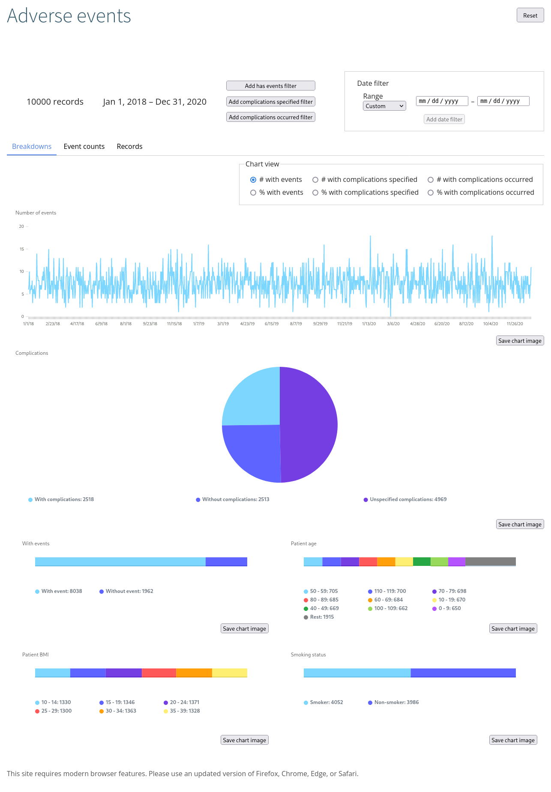
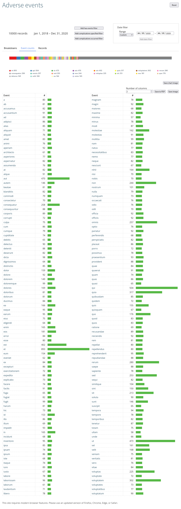

# Adverse events analyzer

An analysis tool for investigating adverse anesthesia events over a long
period.



## Usage

Input is a CSV (optionally ZIP encoded for moderate compression) of adverse
event records. See `example.csv` for fake example data for format information.

Event filtering is done by applying a series of filters. You can click one of
the buttons near the top to reduce the records to only those with adverse
events, or with complications specified (whether yes or no), or records where
complications occurred (yes), and you can add a date filter using the date
inputs in the upper right. Filters are applied additively.

### Breakdowns tab

All of the charts and data will update whenever a filter is applied. You can
change the timeseries chart using the view selection options above it, and you
can save any chart image using the button to its lower right.

### Event counts tab

By pressing on the Event counts tab you should see something like the below
image, which is a breakdown of the number of times each event occurred in the
records list that you’ve filtered to. Clicking on an event name will add that
event to the list of filters.



### Records tab

The Records tab just shows a table of the raw records data that are the result
of the filters you’ve applied. You can also click on an event name here and add
that event to the list of applied filters.

### Data

Screenshots above are of automatically generated fake data.

If you reload the page, or close it and return later on the same computer, it
will try to remember the data you gave it last time so you shouldn’t need to
select it again. This is saved only on the local computer, so if you use a
different computer you’ll have to select it again. The Reset button in the top
right of the page can be used to forget the data, so you can select a new file
when you receive an updated data set in the future. You should also be sure to
click this after you’re finished if on a public computer.

As it mentions in the footer of the page, this app relies heavily on modern
browser features to make navigating such a large data set quick, so please use
a modern browser like Chrome or Edge.

## Building

The crate depends on the
[deserialize](https://github.com/mcw-anesthesiology/deserialize) crate, by
default configured to be in the path `../deserialize` for workspace reasons.
The easiest way to rectify this is to uncomment the `git` dependency in
`dependencies.deserialize` in `Cargo.toml` and remove the `path` dependency:

```toml
[dependencies.deserialize]
git = "https://github.com/mcw-anesthesiology/deserialize.git"
```

Fake data can be generated using the `gen_fake` binary in the crate root. CSV
is sent to stdout, and the number of records can be specified as the first
argument (default 10,000).

`cargo run --bin gen_fake -- 100000 > fake.csv`
